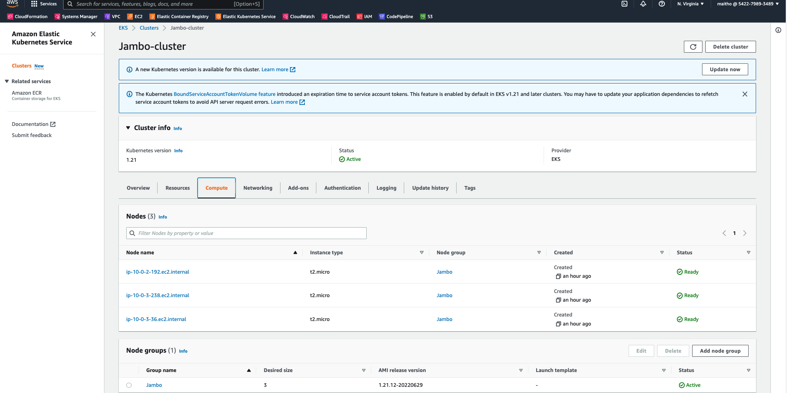
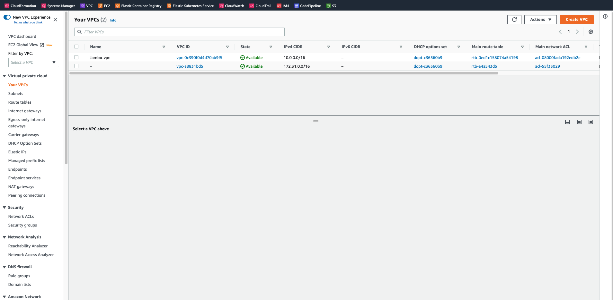
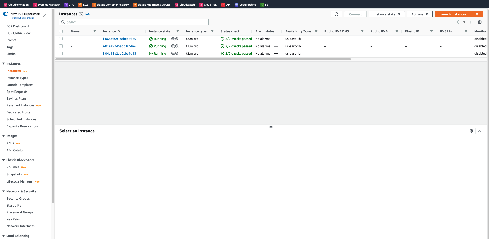
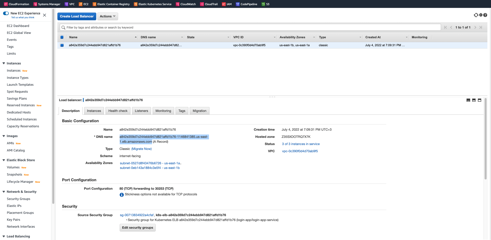
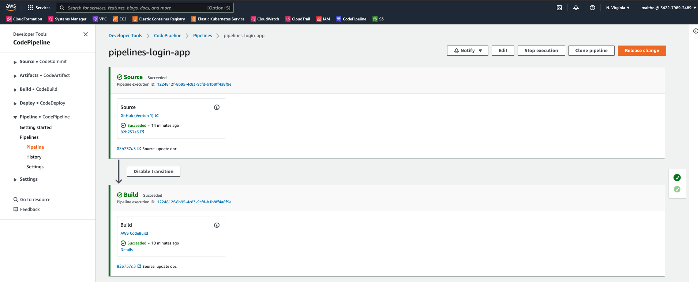
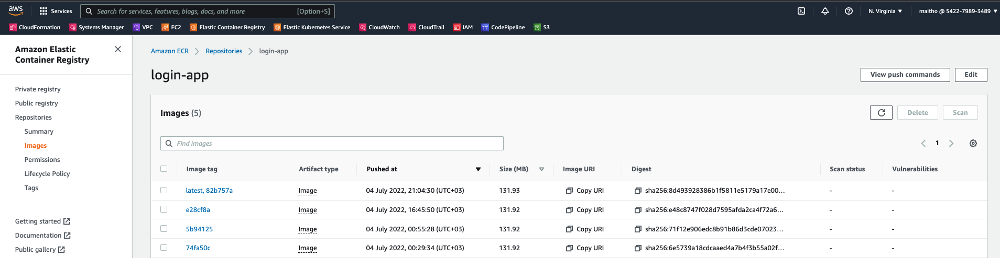

# Live Infrastructure Setup using Terragrunt

Using Terragrunt which is a thin terraform <b>wrapper</b> providing extra tools to keep the <b>backend</b> configuration DRY and used to execute terraffrom commands on <b>multiple modules</b> at once
## Resources:

- [Terragrunt](https://terragrunt.gruntwork.io/)

## Terragrunt Installation

- Windows: using chocolatey: `choco install teragrunt`
- macOS: using HomeB=brew: `brew install terragrunt`
- Linux: using Homebrew: `brew install terragrunt`

To use terragrunt, terrafom is required to be installed:

- macOS: using Homebrew: `brew tap hashicorp/tap && brew tap hashicorp/tap && brew update`
- Winddows: using Chilolatey: `choco install terraform`
- Linux: Using using official HashiCorp singed packages available for the Linux distributions

This setup has been tested with:

- Terragrunt Version: `v0.36.7`
- AWS CLI:  `aws-cli/2.7.11 Python/3.9.11 Darwin/21.5.0 exe/x86_64 prompt/off`
- Terraform: `1.2.3`

## Using Terragrunt commands to define create the Infrastructure

Instead of using `terraform` command directly, we will run the same commands with `terragrunt` which will forward almost all commands, arguments and options directlyy to terrafrom based on tge settigns on the `terragrunt.hcl` file. Se below commands

- terragrunt plan
- terragrunt apply
- terragrunt output
- terragrunt destroy

To create aws resource you will need the (terrafrom modules)[https://github.com/maitho/terraform-infra] source andith this setup, here is how to run terragrunt and create aws reource, a case with SSM paramters
` AWS_PROFILE=<aws-profile> terragrunt apply --terragrunt-source  /<path-to-terraform-modules>/terraform-infra//ssm/`


## Kubernetes Requirements

- kubetcl:

```
clientVersion:
  buildDate: "2022-05-03T13:46:05Z"
  compiler: gc
  gitCommit: 4ce5a8954017644c5420bae81d72b09b735c21f0
  gitTreeState: clean
  gitVersion: v1.24.0
  goVersion: go1.18.1
  major: "1"
  minor: "24"
  platform: darwin/amd64
kustomizeVersion: v4.5.4
serverVersion:
  buildDate: "2022-05-12T18:29:27Z"
  compiler: gc
  gitCommit: d4336843ba36120e9ed1491fddff5f2fec33eb77
  gitTreeState: clean
  gitVersion: v1.21.12-eks-a64ea69
  goVersion: go1.16.15
  major: "1"
  minor: 21+
  platform: linux/amd64
```

- aws-cli : `aws-cli/2.7.11 Python/3.9.11 Darwin/21.5.0 exe/x86_64 prompt/off`
-

## Deploying the Cluster and Resources to AWS

This uses a Make file with predefined commands set. On the root, open the Make file and eddit the `profile` and `terragrunt-source` as is on your local machine.
Modify this [file](https://github.com/maitho/live-infra/blob/main/eng/account.hcl) and use your account.
The following resources will be provisioned on AWS:

- VPC
- EC2
- EKS
- CodePipeline
- ECR

### Deploying the stack

- Deploy all ressources at once `Makedeploy-all`
- Destroy all ressources at once `Makedeploy-all`
- Deploy stack separately:
  - Deploy SSM parameters `MAke deploy-ssm`
  - Deploy pipeline and ecr `Make deploy-pipeline`
  - Deploy eks, vps, ec2 `Make deploy-eks`







